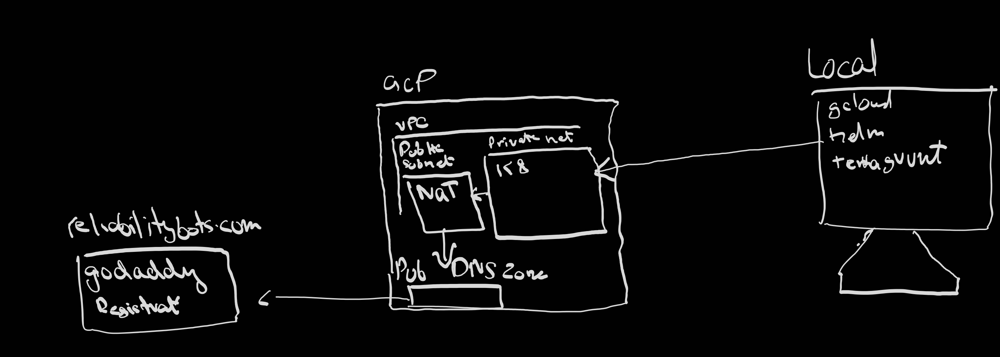
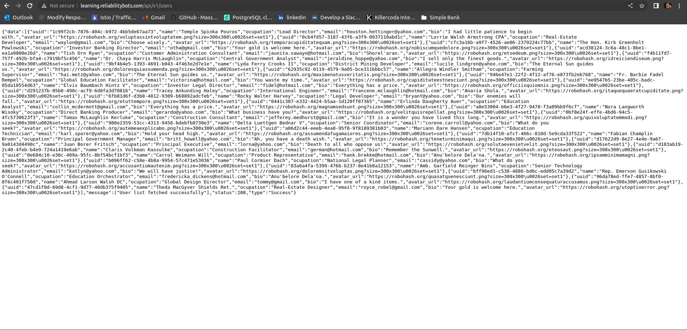
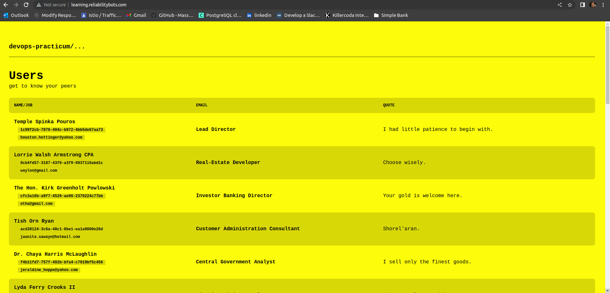
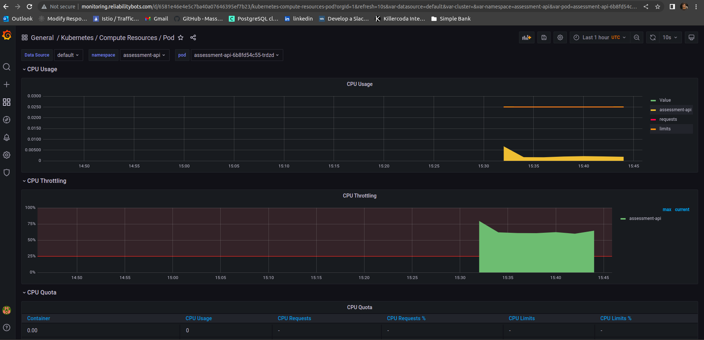

# CareerFoundry Learning Server
<a href="http://learning.reliabilitybots.com/">

</a>

```
!!! Important Note !!!
You will not be able to open website links
I will be destroying the Infra to save cost, But will recreate it before Interview

If you are unable to see the images in .md feel free to refer to ./static folder
```

## Architecture (Abstract)


## Prerequisites

- [Docker Installation](https://docs.docker.com/engine/install/)
- Install **terraform**, **terragrunt**, **helm** & **gcloud** `refer to current repo's ./bin folder and move all the binaries to any of yout $PATH directory`
- Make sure to own a [Google Cloud](https://console.cloud.google.com/) account with a fresh project
- Install [Kubectl](https://kubernetes.io/docs/tasks/tools/install-kubectl-linux/) if you want to access k8 cluster from local


## Important URLS
- http://learning.reliabilitybots.com/api/v1/users
- http://learning.reliabilitybots.com/
- http://monitoring.reliabilitybots.com/


### Execute these operations from current directory of this file

```sh
# Setup local credentials for GCP
gcloud auth login
gcloud components install gke-gcloud-auth-plugin
gcloud auth configure-docker 
```

```sh

# Setup infrastructure for deployments
cd ./ops/terraform/us-central1
terragrunt run-all apply -auto-approve --terragrunt-non-interactive
cd ../../../
```

```sh

# Deploy API & PostgreSQL on K8
cd ./api/
make build-push-gcr-image
make deploy-service
cd ../
```
[API_URL](http://learning.reliabilitybots.com/api/v1/users):  `http://learning.reliabilitybots.com/api/v1/users`



```sh

# Deploy UI on K8
cd ./learning/
make build-push-gcr-image
make deploy-service
cd ../
```
[UI_URL](http://learning.reliabilitybots.com/):  `http://learning.reliabilitybots.com/`



```sh

# Deploy Monitoring
make deploy-monitoring
# User: admin
# Password: prom-operator
```
[GRAFANA_URL](http://monitoring.reliabilitybots.com/):  `http://monitoring.reliabilitybots.com/`


## North-Star Improvements

- Add Service Mesh with Observability (Istio with Yaeger)
- Store all credentials in secret manager | vault
- Decouple old and new versions of servers with versioning builds and CI
- Rollbacks & canary Deployments
- Implement service health check endpoints
- Introduction of CD tooling to facilitate GitOps
- Multi zonal GKE cluster master to mitigate disaster
- Certificate manager to Encrypting in-transit
- Autoscaling not implemented due to cost
- TF State management
- Stress Test with K6


## Tech Stack

Attached are all projects used in this deployment


- [Kubernetes] - Container Orchestrator
- [Docker] - Container Provisioner
- [Make]      - Command-management
- [Prometheus] - Metrics Store
- [Grafana] - Monitoring dashboards
- [helm] - K8 manifest packaging


[Kubernetes]: <https://github.com/kubernetes/kubernetes>
[Docker]: <https://github.com/docker>
[Prometheus]: <https://github.com/prometheus/prometheus>
[Grafana]: <https://github.com/grafana/grafana>
[helm]: <https://github.com/helm/helm>
[Make]: <https://www.gnu.org/software/make/>

## Author

**Hamza Bilal, Site Reliability Engineer @ Careem, Uber Inc**